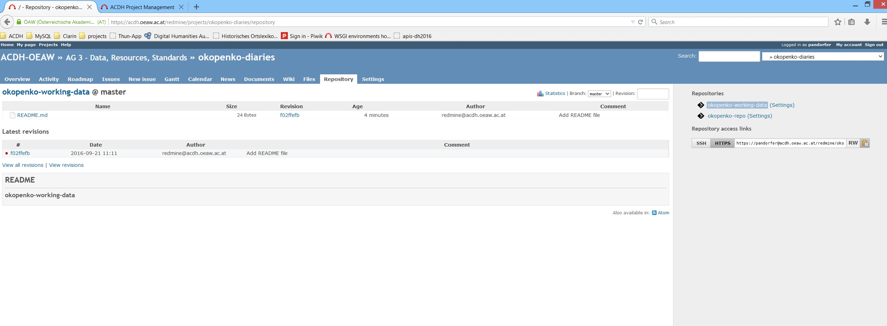
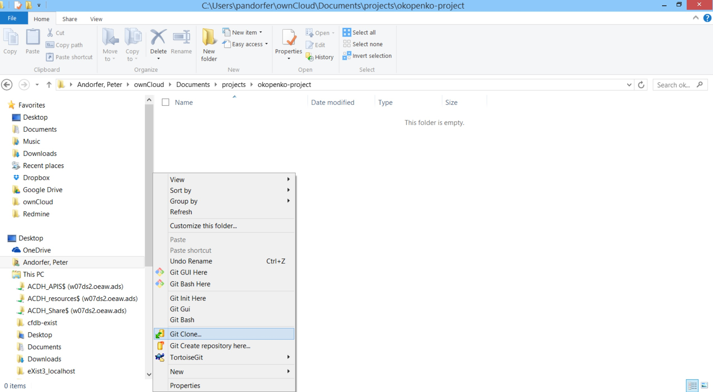
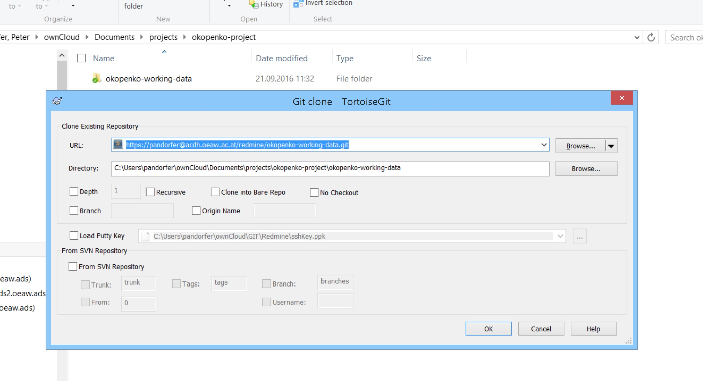
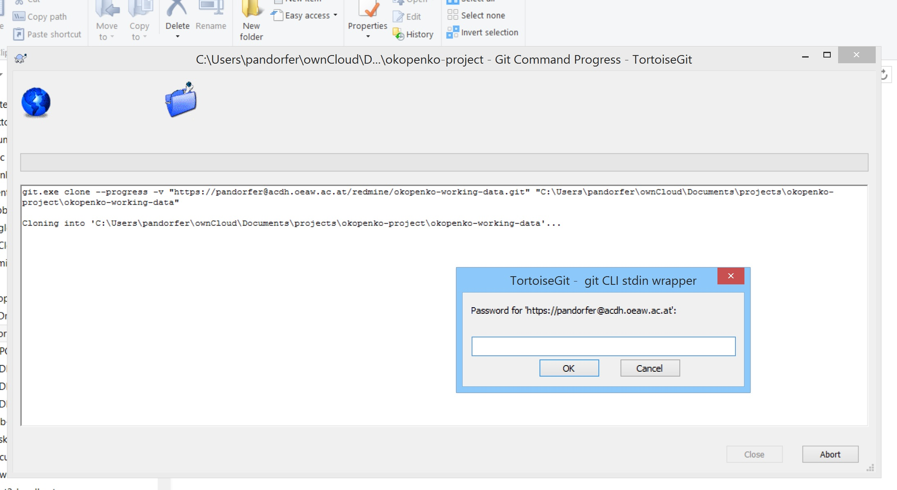
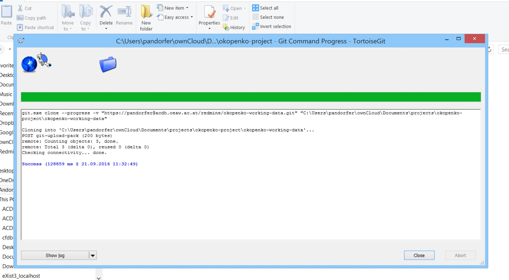
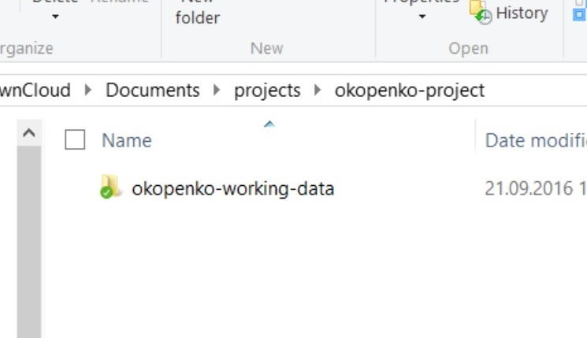

# Cloning a Git Repo

This post describes how to clone a ACDH-Redmine Repo.

To start working with GIT you first have to **clone** the already existing repo called **okopenko-working-data**. To clone the repository you have to 

* log in to [Redmine](https://acdh.oeaw.ac.at/redmine/login) the ACDH's project management tool. 
* Then browse to the repository, either by navigating there or by following this link https://acdh.oeaw.ac.at/redmine/projects/okopenko-diaries/repository.
* There you find on the right sight of the screen a headline saying: **Repository access links**, with two buttons called **SSH** and **HTTPS** an input filed filled with some URL. 
* Select **HTTPS** and the link in the input field follow now this pattern: https://{yourUserName}@acdh.oeaw.ac.at/redmine/{nameOfTheRepo}.git.

* Copy this link
*On your local machine (PC, Laptop) open your file explorer and browse to any directory which should contain the repositories data. Maybe something like, `C:\documentes\okopenko-project\`.
* Because you have [TortoiseGit](https://tortoisegit.org/) installed, you can now perform a **right mouse click** and see some GIT-commands provided by Tortoise. 
* Select **Git Clone...**.

* This opens a **Git Clone Context Menu** displaying the URL of the repo you are going to clone. Make sure the URL matches the one you copied before (which is not the case on the picture on the screenshot). If it not matches, go to the repo, copy the URL again and redo the following steps. It also displays the path of the directory where you are going to clone the repo.

* Click **OK** and in case you are cloning from a private repository like for the okopenko-project you will be asked to enter your (redmine) password. 

* After you entered the password, the repo will be cloned to your local machine and you should some status messages in your Tortoise Client. 

* Click on **Close** and go to your file explorer, browse to the directory where you cloned the repo into it and there you should see a new directory called like the repo.

Congrats. You cloned the repo. Now start working!